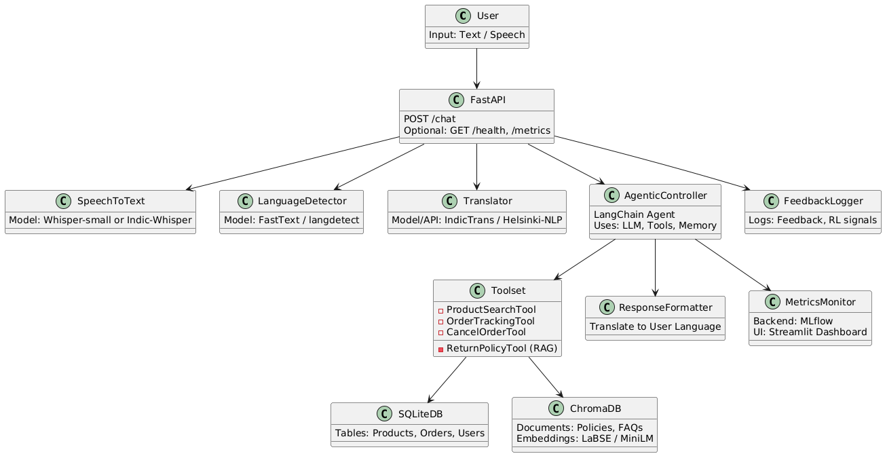

# Retail AI Chatbot

A small retail assistant that combines a FastAPI backend with Streamlit front-ends. The app answers questions about products, orders, and return policies and can also perform actions such as cancelling orders. It uses an SQLite product/order database together with a RAG (Chroma) index for policy text and an LLM for responses.



## Prerequisites

- Python 3.11
- pip
- (Optional) a virtual environment tool such as `venv` or `virtualenv`
- If using the Groq LLM integration: a valid `GROQ_API_KEY` environment variable

## Setup (Windows)
python -m venv .venv
.\.venv\Scripts\Activate.ps1

## Setup (Linux)

1. Create and activate a virtualenv:

```bash
python -m venv .venv
source .venv/bin/activate
```

2. Install dependencies:

```bash
pip install -r requirements.txt
```

3. Set required environment variables (example):

```bash
export GROQ_API_KEY="<your_groq_api_key>"
# Optional overrides
export DB_PATH="db/retail.db"
export RAG_DIR="rag_db"
```

4. (Optional) Recreate data stores if you need to rebuild from CSV/text inputs:

```bash
# Recreates SQLite DB from data/*.csv
python app/setup/init_sqlite.py

# Builds the RAG index from data/return_policy.txt
python app/setup/init_rag.py
```

Note: This repo commits `db/retail.db` and a `rag_db/` folder — you can skip step 4 unless you want to rebuild.

## Running the project

1. Start the backend API (FastAPI). By default it serves on http://127.0.0.1:8000

```bash
uvicorn app.api:app --reload
```

Health check: visit http://127.0.0.1:8000/health

2. Run the Streamlit chat UI in a new terminal:

```bash
source .venv/bin/activate
streamlit run streamlit_chat.py
```

3. (Optional) Run the metrics dashboard:

```bash
source .venv/bin/activate
streamlit run streamlit_dashboard.py
```

## Files of interest

- `app/main.py` — starts the FastAPI backend
- `app/api.py` — request handlers and endpoints
- `app/agent.py` — orchestrates tools and LLM calls
- `app/llm.py` — LLM wrapper / model integrations
- `streamlit_chat.py` — Streamlit chat UI
- `streamlit_dashboard.py` — Streamlit metrics viewer
- `data/` — source CSVs and `return_policy.txt`
- `db/retail.db` — prebuilt SQLite database used by the app
- `rag_db/` — RAG embeddings & vectors

## Development notes

- Environment variables are read from the process environment. You can use a `.env` loader in development if preferred.
- If the LLM integration fails with 500s, verify `GROQ_API_KEY` and network connectivity.

## Troubleshooting

- Missing DB or stale data: run `python app/setup/init_sqlite.py`.
- Missing RAG vectors: run `python app/setup/init_rag.py` (the embedding model may download on first run).
- Backend errors: check console logs where `app/main.py` runs and confirm the API health endpoint.
